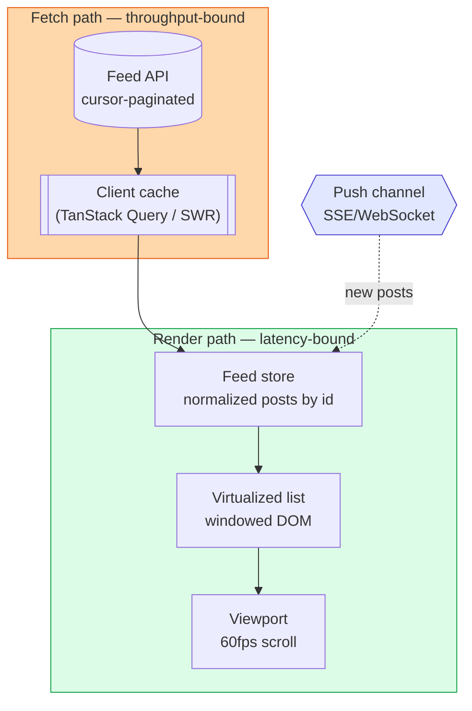

# Frontend System Design: News Feed

> **Session:** Mon Wk1 — Spike track (Frontend system design, GFE). Timed target: 35–45 min.
> **Ships:** this written design + trade-offs. Cold-attempt it yourself first if you haven't; then diff against this.
> **Source pick:** `docs/gfe-study-guide.md` §3 — News Feed is the Wk1 GFE system-design question (a11y + perf focus).

---

## 1. Clarify the problem

**Ask before designing. A senior candidate narrows scope out loud.**

Functional:
- User sees a scrollable feed of posts (text, image, video, reactions, comments count).
- User can create a post. New posts from others should appear without a full reload.
- Infinite scroll, not pagination buttons.

Non-functional (state these as numbers, not vibes):
- Feed load: perceived content in under 1s on a warm cache, under 2.5s cold (this is an LCP budget).
- Scroll must stay at 60fps — no jank on a 5,000-post session.
- Feed works on flaky mobile networks — must degrade, not blank-screen.
- Real-time freshness: "eventually, within seconds" is fine. Not chat-grade real-time.

**Out of scope (say this out loud too):** backend fan-out/fan-in ranking algorithm, storage engine. This is a *frontend* system design round — own the client, treat the API as a contract you can negotiate but not rebuild.

---

## 2. The central split (the one idea that ties it together)

**Render path (what's on screen now, latency-bound) vs. fetch path (what's coming next, throughput-bound and speculative).**

Everything below is one of these two concerns. Windowing, skeleton states, and paint order belong to the render path. Pagination cursors, prefetch, and cache belong to the fetch path. Keeping them separate in your head is what makes the design defensible instead of a pile of features.

---

## 3. High-level architecture

| Component | Job (one line) |
|---|---|
| Feed API client | Cursor-paginated `GET /feed?cursor=X&limit=20`, typed response. |
| Cache layer | TanStack Query — dedupes in-flight requests, caches pages, handles refetch-on-focus. |
| Normalized store | Posts keyed by id, not by page — a like/comment update touches one entity, not a page array. |
| Virtualized list | Only renders the ~15 posts near the viewport. This is the single highest-leverage decision in the whole design. |
| Push channel | SSE (not WebSocket) for "N new posts" banner — one-directional, server-to-client, no need for client-to-server push here. |
| Media loader | Lazy `` / `IntersectionObserver` for below-fold images and video posters. |
| Optimistic UI layer | Like/comment fires the UI update immediately, reconciles with server response, rolls back on failure. |

**Why normalize instead of storing an array of pages:** if post 47 gets a new like, an array-of-pages model forces you to find which page holds post 47 and patch it there. A normalized store (`{ [postId]: Post }` + a separate ordered array of ids) means one `dispatch({ id: 47, likes: +1 })` updates every place that post renders. This is the same reasoning behind normalizing a relational schema — one source of truth, no duplicated-then-drifted copies.

---

## 4. Deep dive — the three things that actually get probed

### 4a. Virtualization (windowing) — protects the 60fps budget

Rendering 5,000 post DOM nodes kills scroll performance long before the network does. A virtualized list (`react-window` / `@tanstack/react-virtual`) renders only the visible slice plus overscan, and recycles DOM nodes as you scroll.

| Approach | Pros | Cons |
|---|---|---|
| Render everything | Simple, no library | Dies at ~200+ posts; jank, memory bloat |
| Fixed-height virtualization | Fast, easy math | Posts have variable height (image vs text vs video) — breaks |
| Variable-height virtualization (measured/estimated) | Handles real feed content | Needs a measurement pass or estimated-then-corrected heights; more complex |

**Key takeaway:** variable-height virtualization is the harder-but-correct answer for a real feed — say so and name the estimate-then-measure technique (render off-screen, cache measured height, correct scroll position) rather than pretending fixed-height is enough.

### 4b. Pagination — cursor over offset

`GET /feed?offset=100&limit=20` breaks the moment new posts are inserted above your window — you get duplicates or skips. `GET /feed?cursor=<opaque-id-or-timestamp>&limit=20` anchors to a stable point in the feed regardless of what's inserted above it.

**Key takeaway:** offset pagination is O(1) to explain but wrong for a live-inserting feed; cursor pagination is the correct default for anything that isn't a static list — name this trade-off unprompted, it's a strong signal.

### 4c. New-content strategy — don't auto-insert above the viewport

Auto-inserting new posts at the top while the user is reading post 12 yanks their scroll position — a real, hated failure mode (see Twitter/X complaints about this exact bug). The standard fix: buffer new posts server- or client-side, show a **"12 new posts" pill** at the top, and only prepend on explicit user tap (which also resets scroll to top on purpose).

**Key takeaway:** never mutate what's in the viewport without user consent — buffer-and-pill, not auto-prepend.

---

## 5. Resilience & degradation (non-negotiable on flaky mobile)

- **Skeleton screens**, not spinners, for first paint — reduces perceived latency and avoids a layout jump when content arrives (a CLS regression otherwise).
- **Stale-while-revalidate**: show cached posts immediately, refetch in background, patch in place. TanStack Query does this by default — name it.
- **Offline queue for optimistic actions**: a like/comment made offline queues in IndexedDB and retries on reconnect, rather than silently failing.
- **AbortController on unmounted requests**: scrolling fast can fire a page-3 request that resolves after the user has scrolled to page 8 — cancel it, don't let a stale response race a fresh one and overwrite it.

---

## 6. Accessibility (GFE explicitly grades this for News Feed)

- Each post is a `role="article"` (or semantic `<article>`) with an accessible name (author + first words) for screen-reader landmark navigation.
- Infinite scroll needs an `aria-live="polite"` region announcing "12 new posts loaded" — a screen-reader user gets no visual cue that content changed.
- Focus management: after "load more" fires (button or scroll-triggered), don't steal focus; but do make sure new content is reachable via normal tab order, not appended outside the DOM order a screen reader expects.
- Keyboard: like/comment/share must be reachable and operable without a mouse — no `onClick`-only `
` buttons.

---

## 7. Trade-offs summary (say these unprompted — this is the signal)

| Decision | Chose | Over | Why |
|---|---|---|---|
| Pagination style | Cursor | Offset | Stable under concurrent inserts; offset breaks with a live feed |
| List rendering | Virtualized (variable height) | Render-all | 60fps budget on 5k+ posts; fixed-height too fragile for mixed content |
| New-post delivery | SSE + buffer/pill | WebSocket / auto-prepend | One-directional need only; auto-prepend breaks reading position |
| State shape | Normalized entity store | Array of pages | O(1) patch on like/comment vs. O(pages) search-and-patch |
| Data fetching | TanStack Query (cache + dedupe) | Hand-rolled `useEffect` fetch | Race-condition safety (Abort + stale-response guard) for free, less code to own |
| First paint | Skeleton + stale-while-revalidate | Spinner + blocking fetch | Better perceived perf, no CLS jump |

---

## 8. Architecture advantages — why this shape, not another

This design separates **render** from **fetch** the same way a well-layered backend separates a **service layer** from a **data-access layer**: each side can change independently. Swapping REST for GraphQL, or offset for cursor pagination, never touches the virtualization code — it only touches the fetch path. Swapping `react-window` for a hand-rolled windowing hook never touches the cache layer. That's the SOLID *dependency-inversion* idea applied to a frontend: the render path depends on a normalized-store *interface*, not on how data got there.

It's also testable by construction: the normalized store is pure data (test with plain objects, no DOM), the virtualization math is pure (test scroll-offset-to-visible-range as a function), and the fetch layer is a thin wrapper you can mock at the network boundary. Three independently testable seams instead of one tangled component — that's the practical payoff of the split, not just an architecture-diagram nicety.

---

## 9. If asked to go further (staff-level follow-ups)

- **Multi-tab consistency:** a like in tab A should reflect in tab B — `BroadcastChannel` API or a shared cache (service worker) across tabs.
- **Ranking-aware prefetch:** prefetch page N+1 when the user is 3 posts from the bottom of page N, not when they hit the exact end — hides the fetch latency inside scroll time.
- **Bandwidth-aware media:** `navigator.connection.effectiveType` to decide whether to autoplay video posters or hold for a tap, on 2G/3G.

---

## Stretch (optional, timed 20–25 min): 1 DSA warm-up

Pick one, timed, from the sliding-window / two-pointer family (keep-warm, not deep):
- **Longest substring without repeating characters** (sliding window + hash set) — maps cleanly to the "windowing" theme of today's session.
- Alternative if that one's cold-recall solid already: **minimum window substring**.

Don't solve it here — do it live, then write one line on the pattern you used, per the "every block ends in an artifact" rule.
