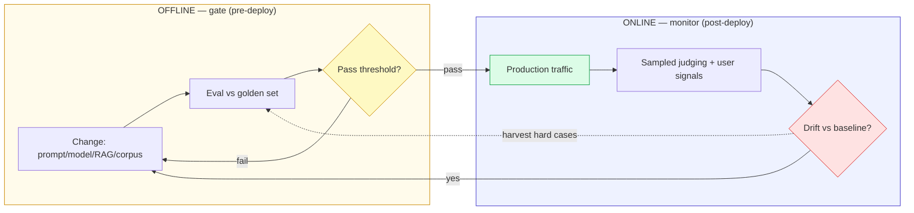
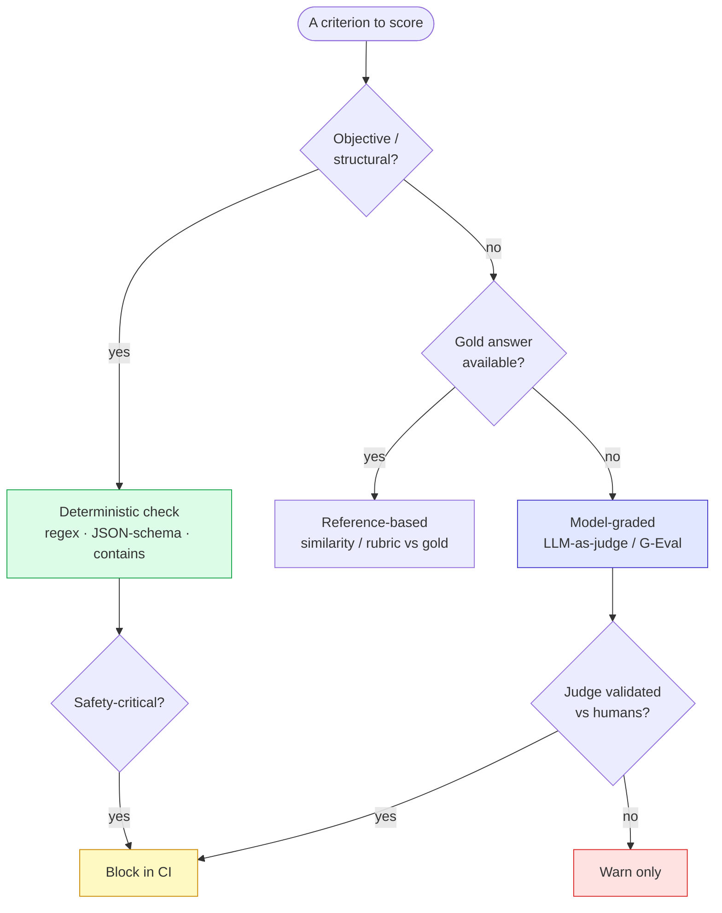
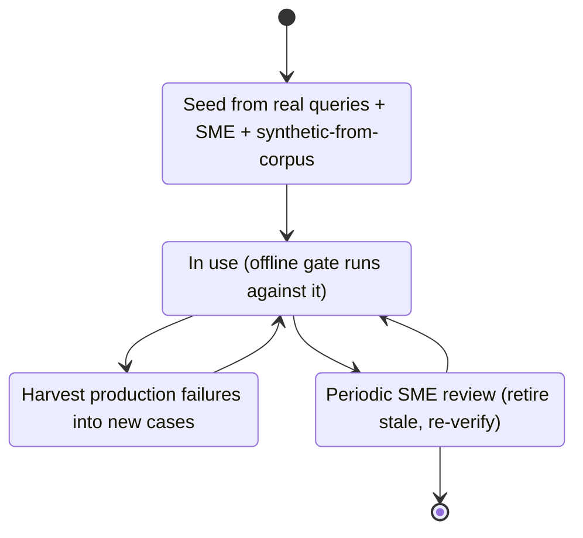
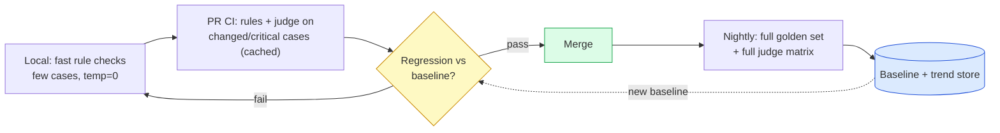
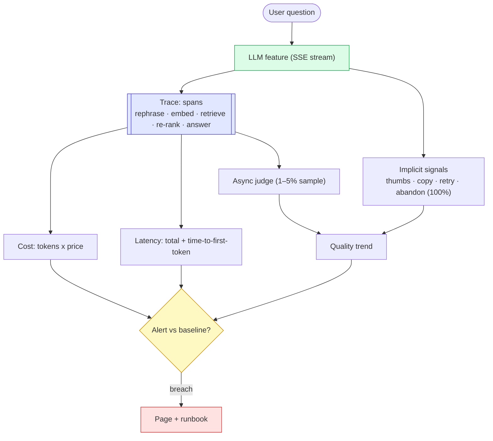
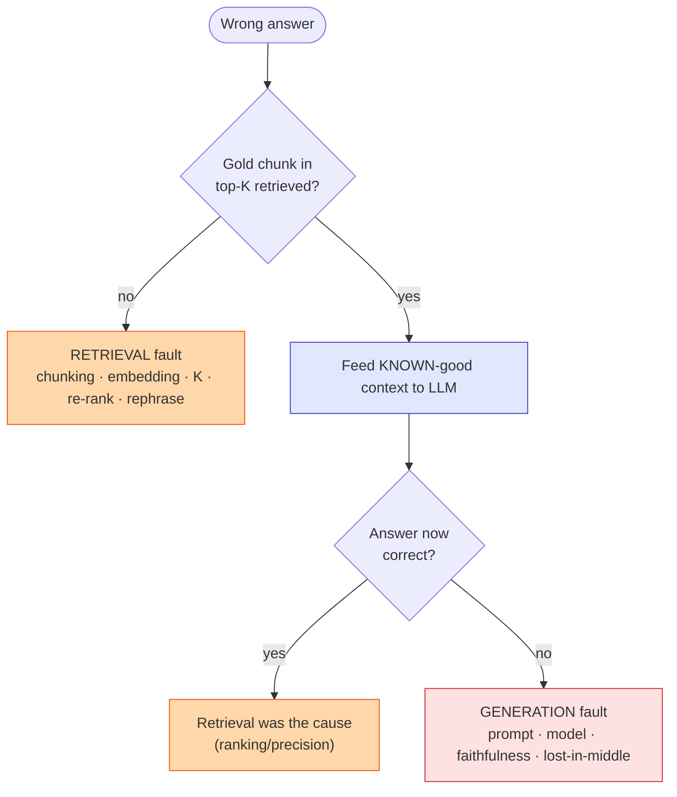
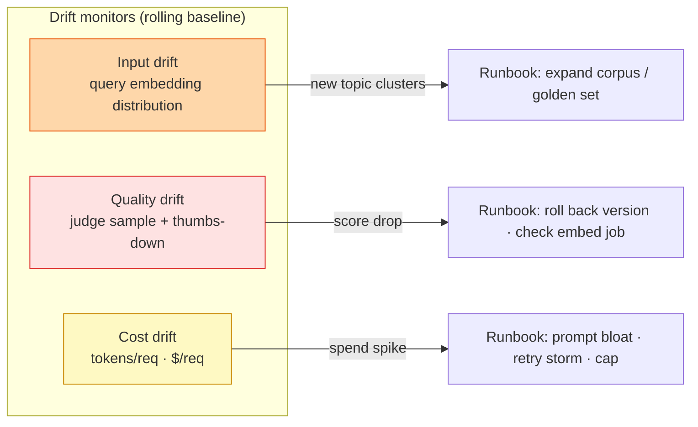
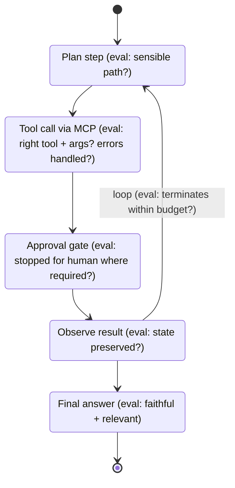

# LLM Eval & Observability — Diagrams

> Start with **Diagram 1** (the central split); the rest zoom into one stage each.
> **Reference:** pairs with [`answers.md`](answers.md) and [`simple-diagram.md`](simple-diagram.md).
> **Cross-links:** retrieval internals → `rag-hybrid-search`; store/index → `vector-databases`; agent eval → `agentic-rag-and-mcp`. See [`../ROADMAP.md`](../ROADMAP.md).

---

## Diagram 1 — The central split: offline gate vs online monitor

> **When to use:** Q2, Q26 — the framing you open any eval answer with.



**What the interviewer is checking:**
- Do you *lead* with this split instead of listing metrics?
- Can you say what each loop *gates* (ship? / still-good?).
- Do you close the loop (prod failures → golden set)?
- Do you know neither loop replaces the other?

---

## Diagram 2 — Scorer decision tree (which scorer for which criterion)

> **When to use:** Q3, Q11, Q14 — choosing a scorer.



**What the interviewer is checking:**
- Rule-first instinct (cheap/objective before expensive/semantic).
- You never let an *unvalidated* judge block merges.
- You know some criteria (safety/format) *must* be deterministic.

---

## Diagram 3 — Golden dataset lifecycle

> **When to use:** Q6–Q10 — building and maintaining the dataset.



**What the interviewer is checking:**
- Dataset is a *living, owned, versioned* artifact, not one-time.
- Production failures feed back in (closes Diagram 1's loop).
- You guard against staleness/rot.

---

## Diagram 4 — LLM-as-judge: protocol + bias control

> **When to use:** Q16–Q20 — how judging actually runs and stays trustworthy.

```mermaid
sequenceDiagram
    participant H as Eval harness
    participant J as Judge model (pinned, different family)
    participant R as Results store
    H->>J: pointwise: score output on rubric (CoT)
    H->>J: pairwise: A vs B (swap order to kill position bias)
    J-->>H: score(s) + rationale
    H->>H: normalize for verbosity; average swapped orders
    H->>R: store score + judge_version + rationale
    Note over H,R: Before trusting in CI: validate judge vs human labels (kappa)
```

**What the interviewer is checking:**
- You name concrete biases (position/verbosity/self-preference) *and* mitigations.
- You validate the judge before gating.
- You pin + record judge version (no silent drift).

---

## Diagram 5 — CI regression gate (dev-loop placement)

> **When to use:** Q21–Q25 — turning eval into a gate people keep green.



**What the interviewer is checking:**
- Cheap-fast on PRs, expensive-thorough nightly.
- Gate on *regression vs baseline*, not a brittle absolute score.
- You've thought about flakiness/cost (caching, temp=0, subset).

---

## Diagram 6 — Online eval: the request trace + signal fan-out

> **When to use:** Q27–Q30 — what you instrument in production.



**What the interviewer is checking:**
- Per-span instrumentation (tokens/latency/ids), not just a top-line timer.
- Sampling for cost + free implicit signals on all traffic.
- Signals map to the three concerns: cost / latency / quality.

---

## Diagram 7 — RAG failure attribution (retrieval vs generation)

> **When to use:** Q12, Q32, Q35 — the single most important RAG-eval move.



**What the interviewer is checking:**
- You *isolate* the two stages with a concrete experiment.
- You know "feed gold context" cleanly tests generation.
- You can name causes on each side.

---

## Diagram 8 — Three drifts, three runbooks

> **When to use:** Q29, Q31 — production degradation.



**What the interviewer is checking:**
- You separate three drift types with *different* causes/responses.
- Alerts are baseline-relative, not absolute.
- Each alert has an actual runbook.

---

## Diagram 9 — Agent trajectory eval (beyond single-shot)

> **When to use:** Q37 — evaluating agents/MCP, not just final answers.



**What the interviewer is checking:**
- Agents need *trajectory + tool-use* eval, not only end-state.
- You check termination/loop budgets and approval-gate adherence.
- You connect this to the capstone's MCP + approval design.

---

## Quick Interview Reference

### Scale numbers (planning — verify/tune)
- Golden set ~30–50 → few hundred; online judge sample ~1–5%; implicit signals 100%.
- Ask AI: 2,667 docs → 7,597 chunks; ≤1,000 tokens/chunk; 1,536-dim cosine; K=5.

### Domain quick-ref
| Stage | Metric/tool | Diagram |
|---|---|---|
| Choose scorer | rule / reference / judge | 2 |
| Dataset | build → harvest → review | 3 |
| Judge | pinned, validated, bias-controlled | 4 |
| Gate | baseline-relative, PR subset + nightly | 5 |
| Prod | traces + sampled judge + implicit signals | 6 |
| RAG debug | retrieval-vs-generation experiment | 7 |
| Degradation | input/quality/cost drift | 8 |
| Agents | trajectory + tool-use | 9 |

### Canonical trade-offs
- Offline gate vs online monitor · deterministic vs model-graded · reference-based vs reference-free · pointwise vs pairwise · inline guardrail vs async eval.

### Common mistakes
- No retrieval/generation split · unvalidated judge in CI · self-judging · unpinned judge/provider · 100% online judging · one accuracy number for open-ended text.
