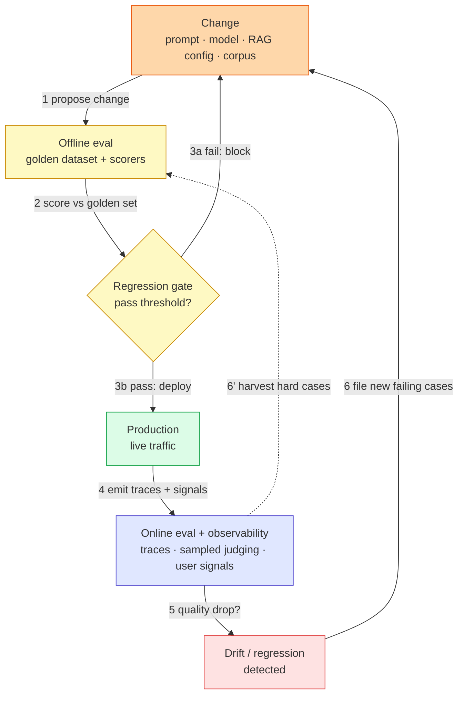
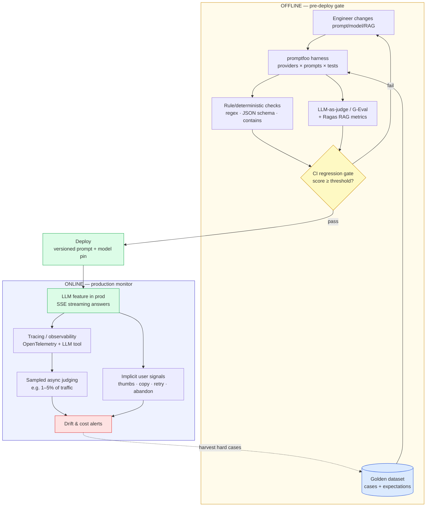

# LLM Eval & Observability — Simple Diagram

> Start here. Two diagrams: the bare mental model first, then the same flow with concrete tools.

---

## 1. Simple mental model

The whole topic is **two feedback loops around a deploy gate.** Offline eval decides *whether a change ships*; online eval decides *whether what shipped is still good*.

### The 6 components to remember

| Component | Job (one line) |
|---|---|
| Change | Any edit that can move quality: prompt, model version, RAG params (chunking, K, re-ranker), or the corpus. |
| Golden dataset | The fixed set of cases with expectations that offline eval scores against. |
| Scorers | Deterministic/rule checks + model-graded (LLM-as-judge) + RAG metrics that turn an output into a number. |
| Regression gate | The CI threshold that blocks a merge/deploy when scores drop. |
| Online eval + observability | Traces, sampled live judging, and implicit user signals on real traffic. |
| Drift detector | Alerts when input, quality, or cost moves beyond a baseline. |

### The one idea that ties it together

**Offline eval is a *gate* (pre-deploy, on a fixed golden set, cheap enough to block CI); online eval is a *monitor* (post-deploy, on sampled real traffic, catching what the golden set never contained).** You need both because the golden set can be green while production quietly rots — and production signals only tell you *after* users were affected. The loop closes when production's hard cases are harvested back into the golden set.

---

## 2. Detailed diagram (concrete, defensible tooling)

These are *defensible* picks that match your stack and the tutor-prompt's vetted tools — not the only valid choices.

### Service cheat-sheet

| Concept | Tool (defensible pick) | One-line why |
|---|---|---|
| Eval harness / gate | **promptfoo** | Declarative providers × prompts × tests × assertions; runs local + CI; has model-graded/G-Eval built in. *(Verify current assertion types in its docs.)* |
| RAG-specific metrics | **Ragas** | Purpose-built RAG metrics (faithfulness, context precision/recall, answer relevancy). *(Metric names have changed across versions — verify current docs.)* |
| Model-graded scoring | **LLM-as-judge / G-Eval** | Scores open-ended quality no rule can express; G-Eval adds chain-of-thought + criteria decomposition. |
| Deterministic checks | Language-native asserts (regex, JSON-schema, string match) | Free, instant, non-flaky — the first line of defense; some criteria *must* be rule-based (see [`answers.md`](answers.md) Q11). |
| Tracing / observability | **OpenTelemetry** + an LLM-aware tool (e.g. Langfuse, Arize Phoenix, LangSmith) | Span-level latency/token/cost per request; ties a user complaint to a specific trace. *(Confirm each tool's current features.)* |
| CI | GitHub Actions (or your CI) | Where the regression gate runs on PRs / nightly. |
| Case study baseline | Ask AI's cosine-sim (`ada-002`) + GPT-4 classifier sheet | The real, shipped eval this topic upgrades — see [`answers.md`](answers.md) Q34. |

### Protocols / concepts worth naming

- **Pointwise vs pairwise judging** — score one output on a rubric, vs pick the better of two (A/B).
- **Reference-based vs reference-free** — compare to a gold answer, vs judge the output standalone (forced when no gold exists).
- **Regression gate** — CI fails the build when an aggregate score drops below a baseline/threshold.
- **Sampling** — judge only a fraction of live traffic to bound online-eval cost.
- **Drift** — statistically significant movement in inputs, output quality, or cost vs a baseline window.
- **Golden-set harvesting** — promoting real production failures into the offline dataset so they're regression-tested forever.

> Cross-links: retrieval details live in `rag-hybrid-search`; store/index choices in `vector-databases`; agent-specific eval in `agentic-rag-and-mcp`. See [`../ROADMAP.md`](../ROADMAP.md).
