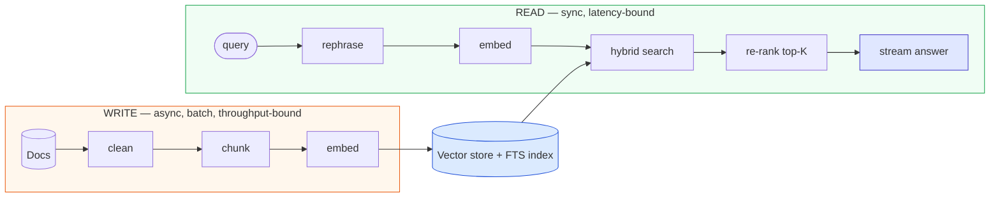
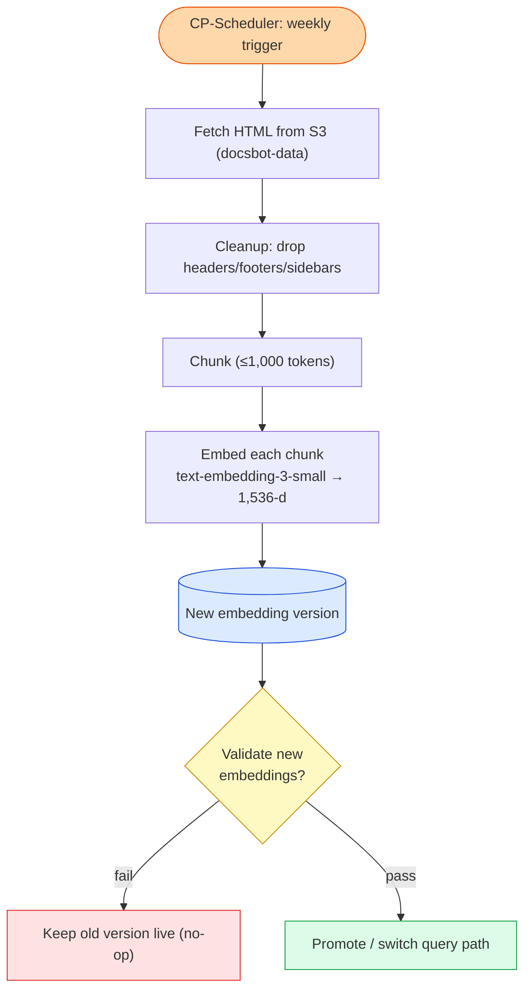
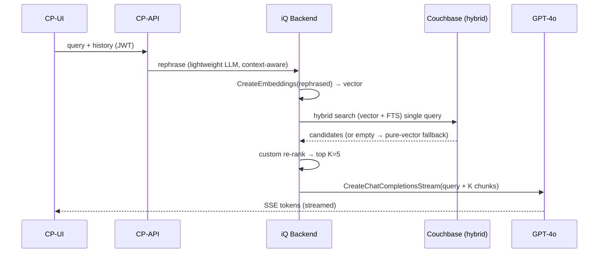
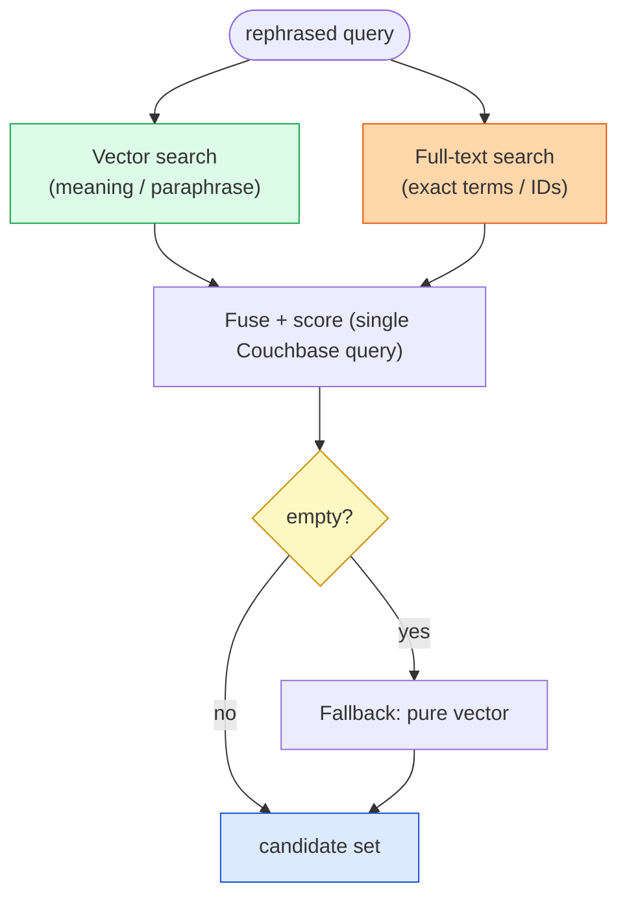
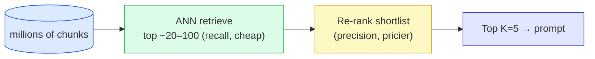
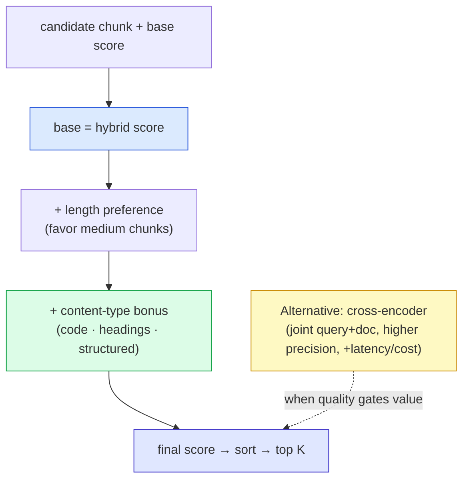
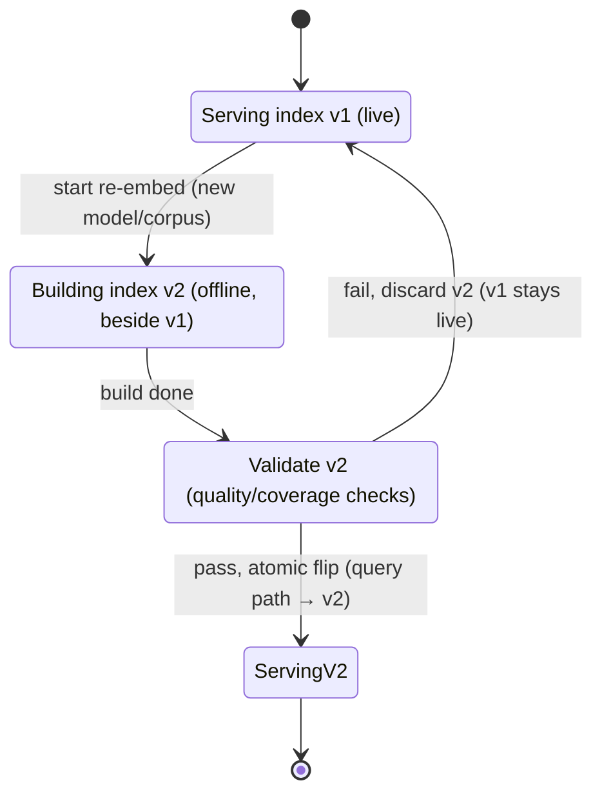
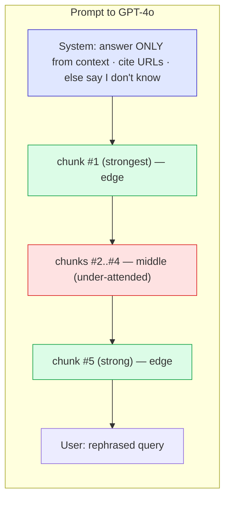
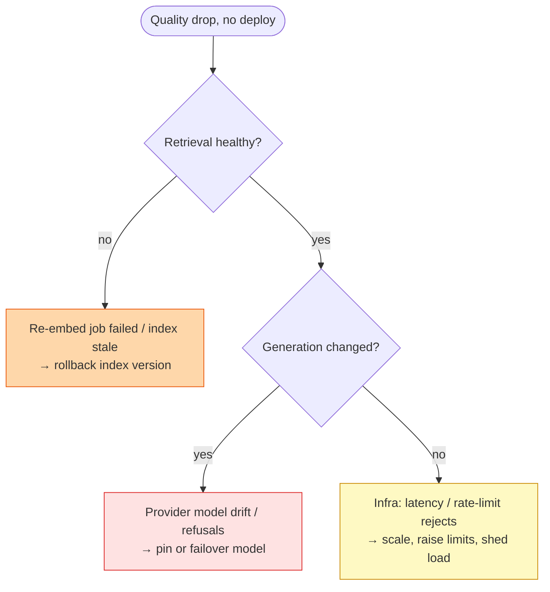

# RAG & Hybrid Search — Diagrams

> Start with **Diagram 1** (the write/read split); the rest zoom into one stage each.
> **Reference:** pairs with [`answers.md`](answers.md) and [`simple-diagram.md`](simple-diagram.md).
> **Cross-links:** eval → [`../llm-eval-and-observability/`](../llm-eval-and-observability/); store/index & pgvector/Pinecone/Couchbase → [`../vector-databases/`](../vector-databases/); agents → [`../agentic-rag-and-mcp/`](../agentic-rag-and-mcp/). See [`../ROADMAP.md`](../ROADMAP.md).

---

## Diagram 1 — The central split: write path vs read path

> **When to use:** Q3, Q4, Q36 — the framing you open any RAG answer with.

**What the interviewer is checking:**
- You *lead* with the two paths, not a pipeline blur.
- You name the opposite constraints (throughput/freshness vs latency/precision).
- You know they scale and fail independently.
- You place the store as the meeting point.

---

## Diagram 2 — Write path in detail (Ask AI CP-Jobs weekly cron)

> **When to use:** Q6–Q10 — indexing, freshness, safe re-embed.

**What the interviewer is checking:**
- Clean before chunk before embed (order matters).
- Build-new-then-validate-then-flip (no in-place mutation).
- A failed run is a no-op, not an outage.
- Parallelism (goroutines) is a throughput lever, not correctness.

---

## Diagram 3 — Read path sequence (request → streamed answer)

> **When to use:** Q4, Q26, Q34 — the live query lifecycle.

**What the interviewer is checking:**
- Rephrase happens *before* embedding.
- Hybrid is one round-trip; fallback is explicit.
- Only rephrased query + K chunks reach the big model.
- Streaming is end-to-end (SSE).

---

## Diagram 4 — Hybrid retrieval + fallback

> **When to use:** Q16–Q19 — dense vs sparse and how they combine.

**What the interviewer is checking:**
- You know what each mode catches (meaning vs exact tokens).
- Why single-query hybrid (latency, engine-native).
- Why a fallback exists (never return nothing).

---

## Diagram 5 — Retrieve-wide → rerank-narrow funnel

> **When to use:** Q20, Q21, Q24 — the efficiency pattern behind ranking.

**What the interviewer is checking:**
- Recall-first retrieve, precision-later re-rank.
- Why you can't precisely rank the whole corpus.
- K is the final, eval-tuned narrowing.

---

## Diagram 6 — Re-ranker anatomy (Ask AI heuristic)

> **When to use:** Q22, Q23 — critiquing/choosing a re-ranker.

**What the interviewer is checking:**
- Each heuristic term should earn its place (ablation).
- Trade-off vs a cross-encoder is explicit.
- Bonuses can override true relevance if unchecked.

---

## Diagram 7 — Zero-downtime re-embed (versioned swap)

> **When to use:** Q9, Q10, Q14, Q37 — model swap / freshness without a broken window.

**What the interviewer is checking:**
- New index built beside the old, never in place.
- Query embedding + index flip happen together.
- Failure path keeps v1 live (no outage).

---

## Diagram 8 — Prompt packing & lost-in-the-middle

> **When to use:** Q31, Q32 — turning K chunks into a grounded prompt.

**What the interviewer is checking:**
- Behavior rules live in the system prompt.
- Strong chunks at the edges (middle is under-attended).
- Sources carried for citations; refuse-if-unknown contract.

---

## Diagram 9 — 2 AM degradation: triage by layer

> **When to use:** Q40 — production incident with no deploy.

**What the interviewer is checking:**
- Triage in path order: retrieval → generation → infra.
- Each layer has a concrete rollback/mitigation.
- Version pinning + per-stage telemetry make this possible.

---

## Quick Interview Reference

### Scale numbers (Ask AI — planning figures, verify)
- 2,667 docs → 7,597 chunks; ≤1,000 tokens/chunk; 1,536-d cosine; K=5.
- Re-embed 5–6 h → ~20 min with 10 goroutines (weekly).
- iQ rate limits: free 100 calls/60s · 2,000 req/day · 500K tok/mo; paid 2,000 req/day · 2M tok/mo.

### Domain quick-ref
| Stage | Key idea | Diagram |
|---|---|---|
| Split | write vs read, opposite constraints | 1 |
| Index | clean→chunk→embed→version→flip | 2, 7 |
| Query lifecycle | rephrase→embed→hybrid→rerank→stream | 3 |
| Retrieval | dense+sparse+fallback | 4 |
| Ranking | retrieve-wide → rerank-narrow | 5, 6 |
| Generation | pack prompt, edges > middle | 8 |
| Incident | triage retrieval/gen/infra | 9 |

### Canonical trade-offs
- Write vs read path · RAG vs fine-tune vs long-context · dense vs sparse vs hybrid · heuristic vs cross-encoder · weekly vs incremental re-embed · K low vs high.

### Common mistakes
- One-pipeline thinking · pure-vector-only · in-place index mutation · mixed embedding spaces · ignoring chunking · unbounded cross-encoder latency · no retrieval-vs-generation attribution · huge K (lost-in-the-middle).
