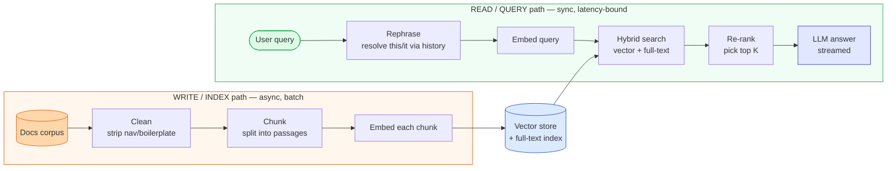
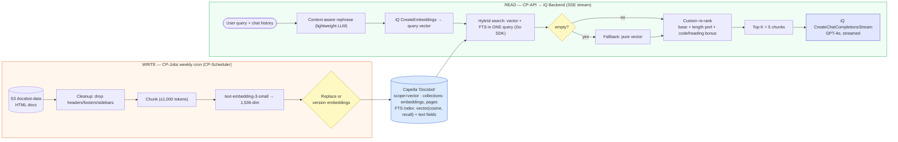

# RAG & Hybrid Search — Simple Diagram

> Start here. Two diagrams: the bare write/read split first, then the same flow with the concrete Ask AI tech.

---

## 1. Simple mental model

The whole system is **two paths that meet at the vector store.** The write path is *async, batch, throughput-bound* (run it weekly, nobody's waiting). The read path is *synchronous, latency-bound* (a user is watching tokens appear).

### The 7 components to remember

| Component | Path | Job (one line) |
|---|---|---|
| Clean | write | Strip boilerplate so embeddings capture real content, not nav chrome. |
| Chunk | write | Split docs into retrievable, embeddable passages (the highest-leverage knob). |
| Embed | both | Map text → vector so semantic similarity = geometric closeness. |
| Vector store + FTS index | shared | Hold vectors *and* text; serve both search modes. |
| Rephrase | read | Turn a context-dependent query into a self-contained one. |
| Hybrid search | read | Vector (meaning) + full-text (exact terms) in one query. |
| Re-rank → top-K | read | Reorder wide candidates, keep the best K for the prompt. |

### The one idea that ties it together

**A RAG system is a write path and a read path that meet at the store, with opposite constraints — so you design, scale, and fail them separately.** The write path optimizes *throughput and freshness* (batch, parallelizable, can be slow); the read path optimizes *latency and precision* (every millisecond and every one of the top-K matters). Most RAG quality problems are really *which path is at fault*, and the split is what lets you answer that.

---

## 2. Detailed diagram (concrete Ask AI tech)

These are the *actual* Ask AI choices (from the design doc) — defensible, not the only options.

### Service cheat-sheet (Ask AI's actual picks)

| Concept | Choice | One-line why |
|---|---|---|
| Corpus source | AWS **S3** (`docsbot-data`) | HTML docs replicated from the docs site; batch-readable. |
| Indexer | **CP-Jobs** cron via **CP-Scheduler**, weekly | Freshness without a streaming pipeline; parallelized with goroutines (5–6h → ~20 min w/ 10 routines). |
| Embedding model | OpenAI **text-embedding-3-small** (1,536-dim) | Cheap, good enough; dims fixed by the model. *(Verify current model options.)* |
| Vector + text store | **Couchbase Capella** (cluster "Docsbot") | Native hybrid search — vectors *and* full-text in one engine/query. |
| Search index | Couchbase **FTS** `fulltext-index`, `embedding` field `dims:1536, similarity:cosine, vector_index_optimized_for:recall` | One index serves vector + lexical. |
| Query rephrase | Lightweight LLM call (context-aware) | Self-contained query; avoids a 2nd large call to save cost/latency. |
| LLM gateway | **iQ Backend** (abstraction over OpenAI) | `CreateEmbeddings` + `CreateChatCompletionsStream`; per-tenant rate limits. |
| Answer model | OpenAI **GPT-4o**, streamed | Quality generation; SSE to the CP-UI. |
| Retrieval width | Top **K = 5** after re-rank | Enough grounding, bounded prompt cost. |

### Protocols / concepts worth naming

- **Dense vs sparse retrieval** — vector similarity (meaning) vs full-text/BM25 (exact terms).
- **Hybrid search** — both run together; here in a *single* Couchbase query, with pure-vector fallback.
- **Fusion / re-ranking** — reconcile incomparable score scales, then reorder (RRF or weighted; Ask AI uses a custom heuristic).
- **Retrieve-wide → rerank-narrow** — fetch many candidates cheaply, spend ranking effort on the shortlist.
- **Context-aware rephrasing** — resolve pronouns/ellipsis from chat history before retrieval.
- **SSE streaming** — token-by-token response for perceived latency.
- **Re-embed & version** — swapping the embedding model means re-embedding the whole corpus; keep versioned backups.

> Cross-links: eval of this system → [`../llm-eval-and-observability/`](../llm-eval-and-observability/); store/index internals & pgvector/Pinecone/Couchbase trade-offs → [`../vector-databases/`](../vector-databases/); turning retrieval into agent tools → [`../agentic-rag-and-mcp/`](../agentic-rag-and-mcp/). See [`../ROADMAP.md`](../ROADMAP.md).
