# Vector Databases — Interview Diagrams

> **Start with Diagram 1.** It is the central split; every other diagram is a zoom into one of its two axes.
> **Reference:** answers in [`answers.md`](answers.md) · plain mental model in [`simple-diagram.md`](simple-diagram.md)
> **Cross-links:** [`../rag-hybrid-search/`](../rag-hybrid-search/) (retrieval paths) · [`../llm-eval-and-observability/`](../llm-eval-and-observability/) (measuring recall)

---

## Diagram 1 — The central split: index vs operating model

> **When to use:** Q5, Q18, Q20, Q41 — and as the opening frame for *any* "which vector DB?" question.

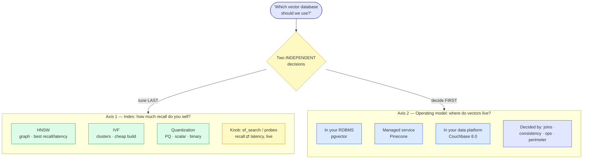

**What the interviewer is checking:**
- Do you separate the two axes, or collapse them into brand preference ("Pinecone is better")?
- Do you drive the operating model from **data and consistency** needs rather than benchmarks?
- Can you name the live recall knob (`ef_search`) versus the build-time commitments (`m`)?
- Do you treat index tuning as the *last* step, not the first?

---

## Diagram 2 — HNSW: why the graph walk is fast

> **When to use:** Q7, Q8 — "explain HNSW", and any "why is it logarithmic" follow-up.

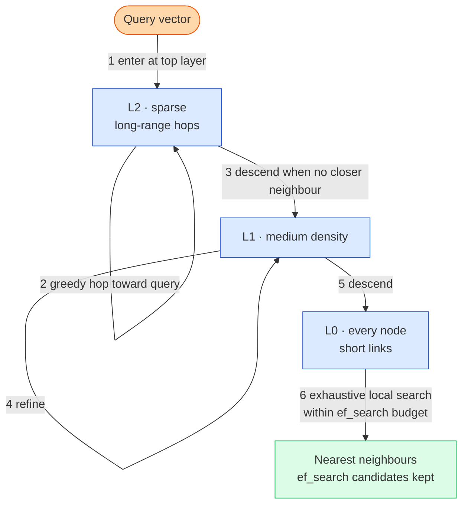

**What the interviewer is checking:**
- Can you explain *why* layers exist (coarse-to-fine, like a skip list) rather than reciting "it's a graph"?
- Do you connect `ef_search` to the **width of the candidate list at L0** — the actual recall/latency dial?
- Do you know the search is **greedy and therefore fallible** — that's the source of imperfect recall?
- Can you say why HNSW needs no training step (contrast with Diagram 3)?

---

## Diagram 3 — IVF: clusters, probes, and the boundary problem

> **When to use:** Q9, Q10 — "explain IVF", "when would you pick IVF over HNSW?"

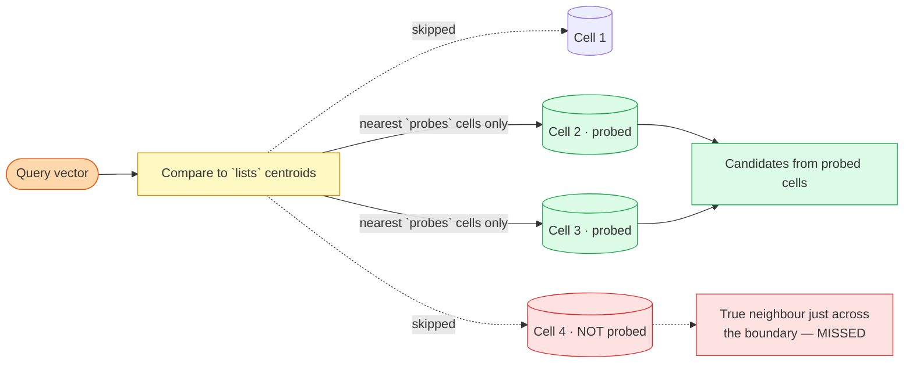

**What the interviewer is checking:**
- Do you name the boundary problem — a near neighbour in an unprobed cell is simply invisible?
- Do you know IVF **requires representative data before building** (k-means training) and HNSW does not?
- Can you say when IVF still wins: build time and memory, not query quality?
- Do you mention centroid **drift** as the corpus changes, requiring retraining?

---

## Diagram 4 — Pre-filter vs post-filter: where recall dies

> **When to use:** Q13, Q14, Q15, Q17 — the highest-signal diagram in this folder.

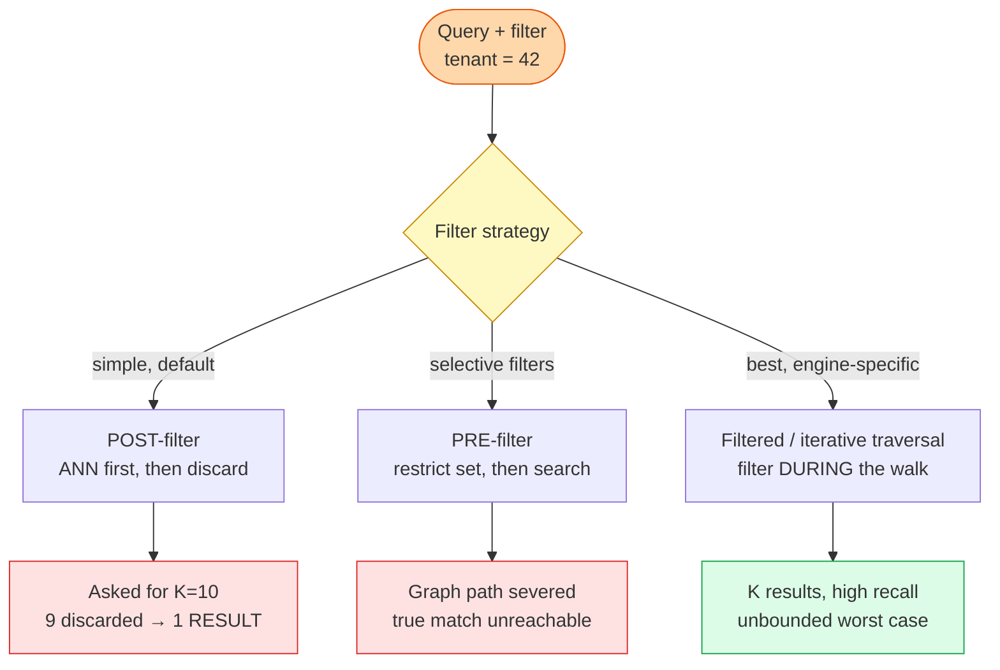

**What the interviewer is checking:**
- Do you know **both** failure modes — short-K (starvation) *and* wrong-K (severed graph)?
- Do you make **selectivity** the deciding variable rather than picking a favourite?
- Do you spot that at very high selectivity the right answer is **brute force**, not ANN at all?
- Do you reach for **partitioning by the filter key** (index per tenant) to dissolve the problem?

---

## Diagram 5 — Quantization and the rescore repair

> **When to use:** Q11, Q31 — "how do you fit this in memory?"

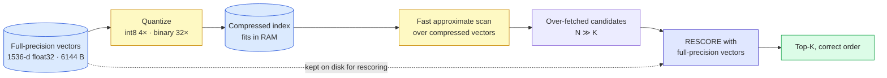

**What the interviewer is checking:**
- Do you pair quantization with **rescoring**, or propose it as a free lunch?
- Can you do the arithmetic (10M × 1536 × 4 B ≈ 61.4 GB → int8 ≈ 15.4 GB)?
- Do you realise full-precision vectors must still be **retained somewhere** to rescore against?
- Do you frame quantization as a *scan* accelerator rather than a storage decision?

---

## Diagram 6 — The dual-write problem

> **When to use:** Q19, Q22, Q23 — whenever a *separate* vector service is proposed.

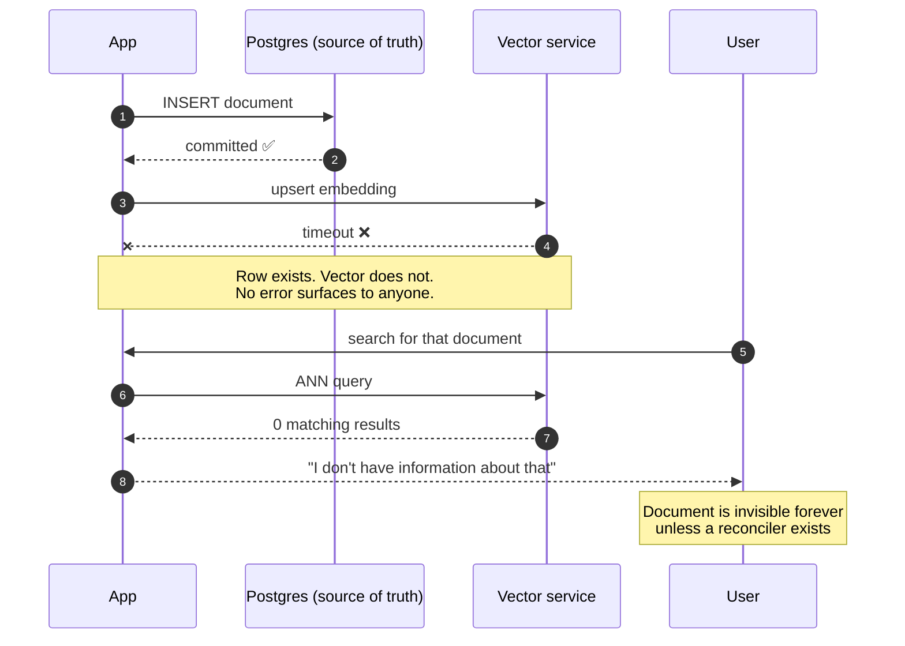

**What the interviewer is checking:**
- Do you identify this **unprompted** when proposing a separate vector store?
- Can you name real mitigations: transactional outbox, CDC, reconciliation sweep?
- Do you note that co-locating vectors with the source of truth **removes** the failure class?
- Do you see that the user-visible symptom is a *plausible* answer, not an error?

---

## Diagram 7 — Hybrid search and Reciprocal Rank Fusion

> **When to use:** Q24, Q25, Q26 — "why isn't vector search enough?"

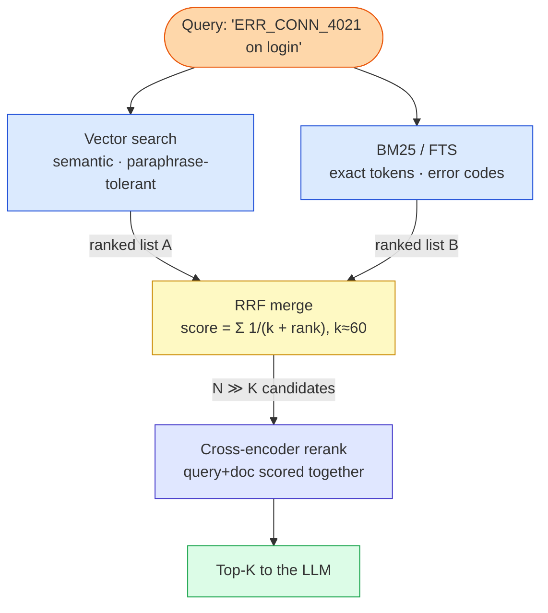

**What the interviewer is checking:**
- Can you say *why* RRF uses **rank not score** (BM25 and cosine scores aren't comparable)?
- Do you distinguish bi-encoder (precomputed, cheap) from cross-encoder (joint, accurate, not precomputable)?
- Do you over-fetch N ≫ K so the reranker has room to work?
- Do you know Couchbase's Search index does hybrid **in a single pass**, avoiding the two-query merge?

---

## Diagram 8 — Full RAG retrieval path: every place recall dies

> **When to use:** Q35, Q37, Q40 — the end-to-end walkthrough.

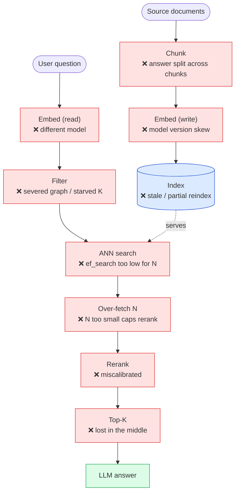

**What the interviewer is checking:**
- Do you see recall as a **product** of every stage — the weakest stage sets the ceiling?
- Do you check chunking *before* tuning index parameters?
- Can you name a diagnostic per stage rather than just listing stages?
- Do you separate **retrieval** failure from **generation** failure (Q39)?

---

## Diagram 9 — Zero-downtime embedding-model migration

> **When to use:** Q29, QB2 — "the embedding model is deprecated, now what?"

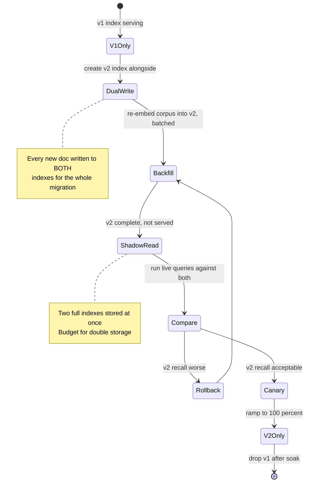

**What the interviewer is checking:**
- Do you know an in-place upgrade is **impossible** — different model means a different vector space?
- Do you include a **shadow-read/compare** phase rather than cutting over blind?
- Do you budget the real costs: re-embedding the whole corpus plus double storage?
- Do you keep v1 warm for rollback?

---

## Diagram 10 — HNSW node lifecycle: why deletes need compaction

> **When to use:** Q30, Q34, Q46 — "how do deletes work?" and slow recall decay.

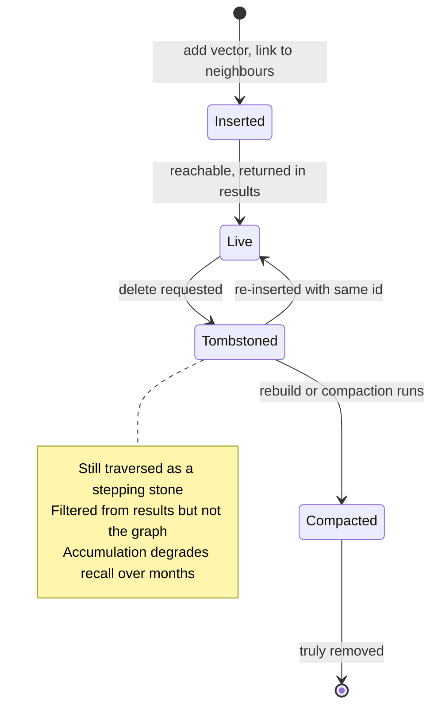

**What the interviewer is checking:**
- Do you know deletion is harder than insertion because nodes are **load-bearing** for traversal?
- Can you explain the tombstone compromise and its cost over time?
- Do you schedule **compaction/rebuild** as routine operations, not an emergency?
- Do you connect tombstone accumulation to the "recall decayed with no deploys" scenario (Q46)?

---

## Diagram 11 — Choosing the operating model

> **When to use:** Q18, Q20, Q21, Q41 — the decision, made from requirements not brands.

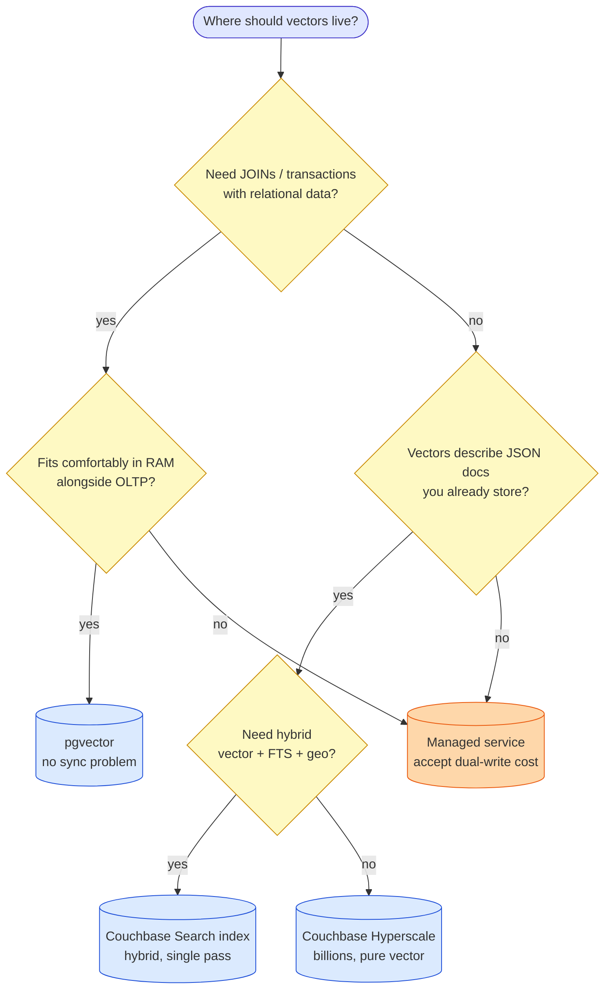

**What the interviewer is checking:**
- Is your first question about **data relationships**, not throughput?
- Do you treat the managed service as carrying a **dual-write tax** rather than being free?
- Do you know Couchbase's index choice is **per query shape**, so one app may need more than one?
- Can you name the pressures that push you *off* pgvector (RAM contention, build vs OLTP)?

---

## Diagram 12 — Debugging "the assistant doesn't know about an indexed doc"

> **When to use:** Q40, Q6 — the most common real-world incident.

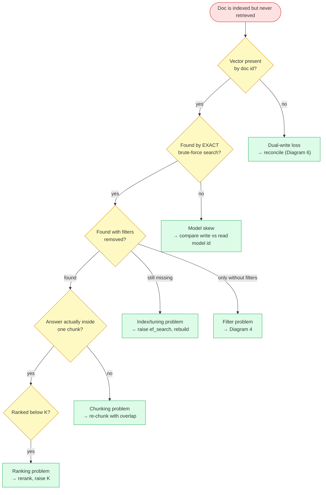

**What the interviewer is checking:**
- Do you **bisect** (exact vs ANN) instead of guessing? That one test halves the problem space.
- Do you check the cheapest thing first (is the vector even there)?
- Do you reach for a **brute-force comparison** as a debugging primitive?
- Can you name the fix for each branch, not just the diagnosis?

---

## Quick Interview Reference

### Scale numbers

| Quantity | Math | Result |
|---|---|---|
| Raw vectors, 10M × 1536-d | `10e6 × 1536 × 4 B` | **~61.4 GB** |
| Same, int8 quantized | `10e6 × 1536 × 1 B` | **~15.4 GB** (4×) |
| Same, binary | `10e6 × 192 B` | **~1.9 GB** (32×) |
| HNSW graph, m=16 | `~83 B × 10e6` | **~0.83 GB** |
| Exact search cost | `N × dims` | **~1.5 × 10¹⁰** ops/query |
| 0.1% selective filter of 10M | — | **10K vectors** → brute force |
| pgvector comfort zone | *approximate* | millions → low tens of millions |
| Couchbase Search (FTS) index | vendor-stated | **~100M docs** |

### Domain quick-ref

| Term | One line |
|---|---|
| **HNSW** | Layered proximity graph; best recall/latency; no training step |
| **IVF** | k-means cells; probe the nearest `probes`; needs training data first |
| **`ef_search`** | Query-time recall dial — **no rebuild required** |
| **`m` / `ef_construction`** | Build-time commitments — rebuild to change |
| **PQ / SQ / binary** | Quantization; pair with **rescoring** |
| **Pre-filter** | Filter then search; can sever the graph |
| **Post-filter** | Search then filter; can starve K |
| **RRF** | Merge ranked lists by rank, `1/(k+rank)`, k≈60 |
| **Cross-encoder** | Joint query+doc scoring; accurate; not precomputable |
| **recall@K** | Fraction of true top-K returned — the metric nobody measures |

### Canonical trade-offs
- **HNSW vs IVF** — recall/latency + no training vs cheap build + low memory.
- **Pre- vs post-filter** — wrong-K vs short-K; *selectivity decides*.
- **Quantization vs precision** — 4–32× memory vs ordering error; rescore repairs it.
- **In-RDBMS vs managed** — joins and no sync problem vs elastic scale and no index ops.
- **Bigger K vs reranking** — more context and distractors vs fewer, better chunks.
- **Shared index + filter vs index-per-tenant** — fewer indexes vs correct recall and isolation.

### Common mistakes
- Quoting speed without stating **recall**.
- Treating filtering as a detail — it is the hardest part.
- Proposing a separate vector store without naming the **dual-write** problem.
- Suggesting an in-place embedding-model upgrade.
- Never saying how recall would be **measured**.
- Using ANN at 10K documents where brute force is exact and simpler.
- Forgetting hybrid search for corpora full of identifiers and error codes.
