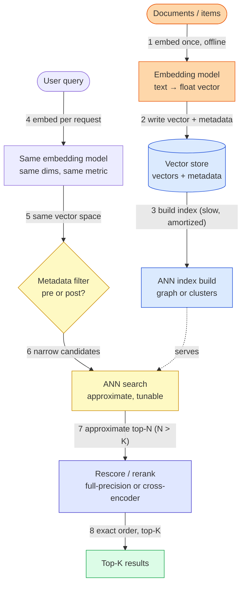
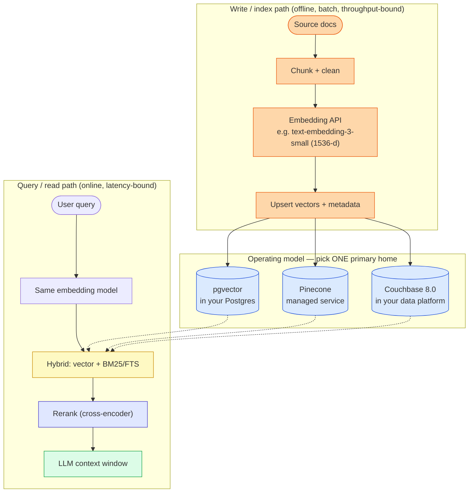

# Vector Databases — Simple Diagram

> Start here. Two diagrams: the bare mental model first, then the same flow with concrete tech.

---

## 1. Simple mental model

The whole topic is **one lossy shortcut and the knobs that control how lossy it is.** Exact nearest-neighbour
search over millions of high-dimensional vectors is too slow, so every vector database replaces it with an
**approximate** search (ANN). Everything else — index type, filtering strategy, quantization, reranking — is
you deciding *how much recall to sell* for latency and cost.

### The 8 components to remember

| Component | Job (one line) |
|---|---|
| Embedding model | Turns content into a fixed-length vector. **Write path and read path must use the same model, dims, and distance metric** — otherwise results are silently meaningless. |
| Vector store | Durably holds vectors *plus the metadata you will filter on*. The metadata is not an afterthought; it decides which index type you can use. |
| ANN index | The lossy shortcut. A **graph** (HNSW) or **clusters** (IVF), optionally **quantized** to shrink memory. Built slowly, queried fast. |
| Metadata filter | Restricts candidates by scalar/text fields. **Pre-filter vs post-filter is where recall silently dies** — see the one idea below. |
| ANN search | Walks the index and returns *approximate* neighbours. Every engine exposes a knob (`ef_search`, `nprobe`) that buys recall with latency. |
| Rescore / rerank | Re-orders approximate candidates using full-precision vectors, or a cross-encoder for real relevance. Fixes quantization error. |
| Top-K | What the LLM actually sees. Over-fetch N > K, then rerank down to K. |
| Recall | The metric that matters and the one nobody measures: *of the true nearest neighbours, what fraction did I return?* Latency is easy to see; missing recall is invisible. |

### The one idea that ties it together

**Two independent decisions get conflated: the *index* (how you buy recall with memory and latency) and the
*operating model* (where the vectors live relative to the rest of your data).** People argue "pgvector vs
Pinecone" as if it were one choice; it is two. The index question is a recall/latency/memory triangle you can
tune in any engine. The operating-model question is about **joins, consistency and ops** — whether your vectors
sit next to your relational rows, next to your documents, or in a separate service you must keep in sync. Pick
the operating model from your *data and consistency* needs, then tune the index for recall.

---

## 2. Detailed model — the same flow with real tech

> These are *defensible* picks, not gospel. Any of the three stores below can serve a competent RAG system;
> what changes is what you give up.

### Service cheat-sheet

| Concept | Service | One-line why |
|---|---|---|
| Vectors beside relational rows | **pgvector** (Postgres ext.) | You already run Postgres; you get real `JOIN`s, transactions and one backup story. Index types: **IVFFlat** and **HNSW**. |
| Vectors as a managed service | **Pinecone** | You want no index ops and elastic scale, and you accept a second system to keep in sync with your source of truth. |
| Vectors beside your documents | **Couchbase 8.0** | Vectors live with the JSON they describe. Three index types (below) — including hybrid vector+FTS+geo **in a single pass**. |
| Hybrid keyword + semantic | FTS/BM25 alongside ANN | Vectors miss exact identifiers, error codes and rare product names. Keyword search catches what embeddings blur. |
| Final ordering | Cross-encoder reranker | ANN gives *candidates*; a reranker gives *relevance*. Cheap accuracy win before spending context tokens. |

### Couchbase 8.0 — three vector indexes, not one

Worth knowing precisely, because the choice is made **per query shape**, not per project
(source: [Couchbase Docs — Choose the Right Vector Index](https://docs.couchbase.com/cloud/vector-index/use-vector-indexes.html)):

| Index | Optimized for | Filtering | Stated scale |
|---|---|---|---|
| **Hyperscale** | Pure vector search, lowest memory (mostly on disk) | ❌ none | billions of vectors |
| **Composite** | Vector + **scalar pre-filter**, when filters cut most of the dataset | ✅ scalar | tens of millions → billions |
| **Search (FTS)** | **Hybrid** vector + full-text + geospatial in one pass | ✅ FTS + geo | ~100M documents |

> Note the trade the Composite index makes explicit: *"scalar values filter data before vector search,
> potentially missing relevant results."* That is the pre-filter recall problem, stated by the vendor.

### Knobs and terms worth naming

- **HNSW** (graph): `m` = links per node, `ef_construction` = build-time candidate list, **`ef_search`** =
  query-time candidate list. Raising `ef_search` buys recall with latency, **at query time, no rebuild.**
- **IVFFlat** (clusters): `lists` = number of clusters, **`probes`** = clusters scanned per query. Needs
  representative data present *before* building; HNSW does not.
- **Quantization**: **PQ** (product), **SQ** (scalar), **binary**. Shrinks memory and speeds scans at the cost
  of precision — which is exactly what the rescore step exists to repair.
- **Distance metrics**: cosine, dot/inner product, L2. In pgvector: `<=>` cosine, `<#>` negative inner
  product, `<->` L2. **Must match how the embedding model was trained.**
- **Recall@K** — the quality metric. **ANN search has no error message**; a badly tuned index returns
  confident, plausible, wrong neighbours. You only find out by measuring against an exact (brute-force) baseline.

> ⚠️ **Verify before quoting:** pgvector's current release is **0.8.0** (which added *iterative index scans*,
> aimed squarely at the filtering problem). Version-specific operator and knob names should be re-checked
> against [pgvector's README](https://github.com/pgvector/pgvector) — I have not re-verified every operator
> against the current release. Couchbase figures above are the vendor's own stated numbers, not benchmarks.
